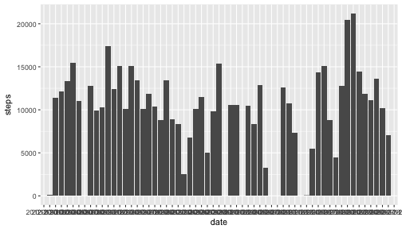
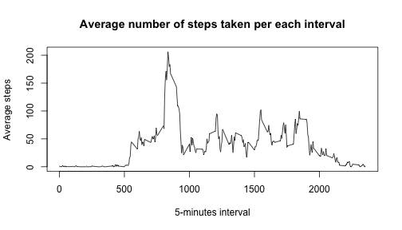
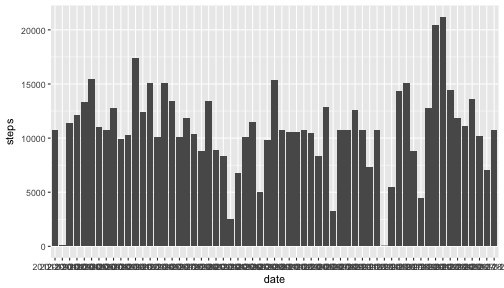
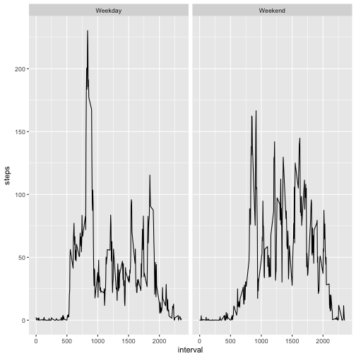

```r
title: "Activity Monitoring"
```

```
## Warning: NAs introduced by coercion
```

```
## Error in title:"Activity Monitoring": NA/NaN argument
```

```r
output: 
    html_document:
        keep_md: true
```

```
## Error in eval(expr, envir, enclos): object 'output' not found
```


## Add libraries required for the report


```r
library(ggplot2)
library(dplyr)
library(lubridate)
```

## Reading data set and processing data

```r
activity <- read.csv("activity.csv")
```

## Histogram of total steps taken per day

```r
activityZeros <- activity
activityZeros[is.na(activityZeros$steps),]$steps <- 0
totalSteps <- aggregate(steps ~ date, activityZeros, sum)
ggplot(totalSteps, aes(x = date, y=steps)) + geom_histogram(stat = "identity")
```



## Calculate mean and median of total steps taken per day

```r
meanTotalStepsPerDay <- mean(totalSteps$steps)
medianTotalStepsPerDay <- median(totalSteps$steps)
```

Mean of total steps taken per each day is 9354.2295082.  
Median of total steps taken per each day is 1.0395 &times; 10<sup>4</sup>.  

## Time series plot of average number of steps taken per each interval

```r
byInterval <- aggregate(steps ~ interval, activity, mean)
plot(byInterval$interval, byInterval$steps, type = "l", main="Average number of steps taken per each interval", ylab = "Average steps", xlab = "5-minutes interval")
```



## 5 minutes interval that, on average, contains the maximum number of steps

```r
sortedIntervals <- arrange(byInterval, desc(steps))
maxInterval <- sortedIntervals$interval[1]
maxAverage <- round(sortedIntervals$steps[1], digits = 2)
```

The 5 minutes interval that, on average, contains the max number of steps is 
835 and the average of steps on that interval is 206.17.

## Imputing missing data
My strategy to imput the missing data was using the average of steps on the interval that misses a measurement. So for that I created a function called imputNas that receices a parameter for the interval of a missing data (*x*) and an data frame that contains the average of steps per each interval.

```r
imputeNas <- function(x, byInterval) {
    intervalMean <- filter(byInterval, interval == x)
    intervalMean$steps
}
```

Per each row of the data frame if the value was missing I set the steps for that interval using the *imputeNas* function.

```r
activityImputed <- activity
for (i in 1:nrow(activityImputed)) {
    if (is.na(activityImputed[i,]$steps)) {
        activityImputed[i,]$steps <- imputeNas(activityImputed[i,]$interval, byInterval)
    }
}
```

## Histogram of total number of steps per day after missing values are imputed

```r
totalImputed <- aggregate(steps ~ date, activityImputed, sum)
ggplot(totalImputed, aes(x = date, y=steps)) + geom_histogram(stat = "identity")
```



## Comparison of the average number of steps taken per 5-minute interval across weekdays and weekends

```r
activityWeekdays <- activityImputed
activityWeekdays$date <- ymd(activityWeekdays$date) 
activityWeekdays$weekday <- weekdays(activityWeekdays$date)
activityWeekdays <- mutate(activityWeekdays, 
    daytype = ifelse((weekday == "Saturday" | weekday == "Sunday"), "Weekend", "Weekday"))

byIntervalWeekdays <- aggregate(steps ~ interval + daytype, activityWeekdays, mean)
ggplot(byIntervalWeekdays, aes(x = interval, y=steps)) + geom_line() + facet_grid(. ~ daytype)
```


```

